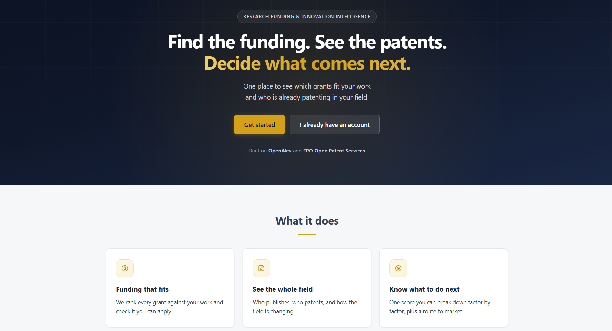
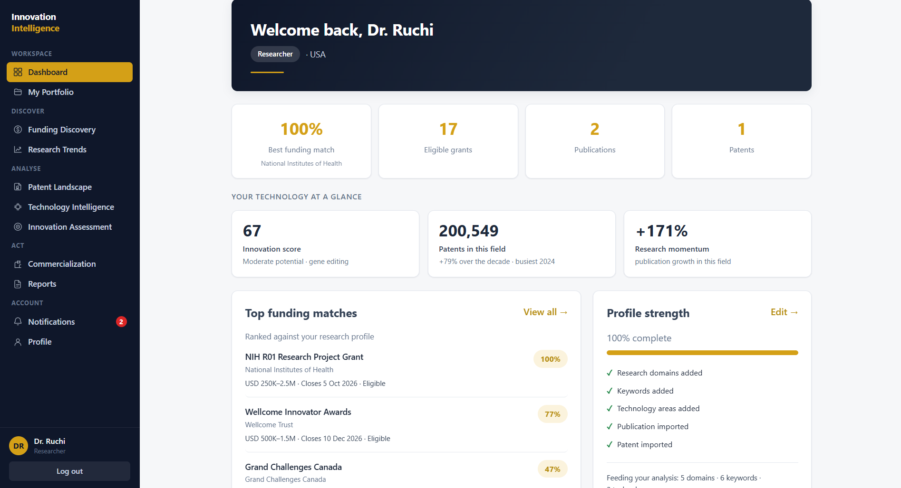

# Innovation Intelligence Platform

A research funding and innovation intelligence platform for researchers, startup
founders and R&D teams. It answers four questions about a technology field in one
place: **who is funding it, where the research is going, who already owns the patents,
and whether it is worth commercialising.**

Built solo, end to end — database schema, API, analytics, frontend, tests and
deployment.

**Live demo:** <https://innovation-intelligence-platform.vercel.app/> &nbsp;·&nbsp;
**API docs:** [`/docs`](https://innovation-intelligence-platform.vercel.app/docs)


> The API is on free-tier hosting that sleeps when idle, so the first request after a
> quiet period takes up to a minute to wake it. The page itself loads immediately.





---

## What it does

Research output, patent activity and funding opportunities normally live in three
separate places, and a researcher deciding whether to pursue a technology has to
cross-reference them by hand. This platform joins them.

A user describes their research profile once — domains, keywords, technology areas,
region, existing publications and patents. Every module then works from that profile
rather than asking again.

| The user wants to know | The platform gives them |
| :--- | :--- |
| What can I apply for? | Funding recommendations ranked on domain overlap, role eligibility, geography and TF-IDF keyword similarity, with eligibility checked rather than assumed |
| Is this field growing? | 12-year publication trend from OpenAlex, sub-field distribution, emerging topics, high-impact papers |
| Who already owns this? | Field-wide patent counts, filing trend, top holders by true count, and thematic clusters from TF-IDF + K-means |
| How mature is the field? | An Emerging / Growing / Mature call, research growth against patent growth, and ownership concentration |
| How strong is my position? | A 0–100 innovation score from five weighted factors, each breakable down |
| What should I do next? | A commercialisation route (spin-out, partnership, licensing or validate-first) and a dated action list |
| Can I show someone? | Nine role-scoped reports, on screen, as a spreadsheet and as a PDF |

Every figure states what it was measured on. Nothing derived from a sample is
presented as a whole-field fact.

### Four roles, four different surfaces

| Role | Portfolio | Primary surface |
| :--- | :---: | :--- |
| `researcher` | Yes | Funding, trends, patents, assessment, commercialisation |
| `startup_founder` | Yes | Same modules, founder-facing advice |
| `innovation_manager` | No | Pipeline triage across the innovators they oversee |
| `admin` | No | User management, platform health, database statistics |

The two portfolio-owning roles get identical scores from identical modules and
**different advice** — a researcher is told to contact their technology transfer
office, a founder to contact a patent attorney before the next public demo.
Self-registration is limited to the first two roles.

---

## Engineering decisions

**Patent counts and patent text come from different data.** EPO returns a count for a
whole field in one cheap request, but reading the records is slow. Counts therefore use
the entire corpus, while anything needing the text inside a patent uses a
**date-balanced sample of 1,100 records** — 100 per year across 11 years, so no single
year dominates the vocabulary. Each figure says which of the two it came from.

**A route census walks every endpoint the app serves.** It fails the build if one
answers an unauthenticated caller, or if an `/api/admin` route answers an ordinary
account. Hand-written check lists always miss the endpoints nobody remembered to think
about, so the test enumerates the router instead of trusting a list.

**Derived analysis is cached against a content hash.** Clustering, applicant tallies and
ownership concentration are computed at seed time and stored keyed by a hash of their
input, so page loads stay fast regardless of sample size.

**Reports render three ways from one server-side structure**, so an exported file cannot
state a figure the screen never showed. Spreadsheet cells are real numbers with display
formats applied, so they sort and total correctly.

**Privileged access is data, not a constant.** Super-admin is a flag on an administrator
rather than a fifth role, so no existing role gate needed widening. The last holder
cannot be removed, and every grant or revocation is written to an audit trail that
deliberately has no foreign keys, so a record outlives the account it describes.

**Sign-in cannot be used to discover who is registered.** It spends the same time on an
unknown address as a real one. Rate limits are keyed to the effect — guessing, queue
creation, redemption — rather than one per endpoint, and every limiter is derived from
its module so a new one cannot be left out.

**Tests run against real PostgreSQL, in CI too.** The schema uses `JSONB` and the code
uses Postgres-only `INSERT ... ON CONFLICT`, so substituting SQLite would mean testing
code the deployment never runs.

---

## Technology stack

| Layer | Technologies |
| :--- | :--- |
| **Frontend** | React (Vite), Recharts |
| **Backend** | FastAPI, SQLAlchemy 2, Pydantic v2, async HTTPX |
| **Database** | PostgreSQL, with JSONB columns for domains, keywords and eligibility rules |
| **Auth** | JWT with role-based access control, bcrypt password hashing |
| **ML / analytics** | scikit-learn — TF-IDF, K-means clustering, cosine similarity |
| **Testing & deployment** | pytest against a real PostgreSQL, GitHub Actions, Docker Compose, nginx |

**Data sources.** OpenAlex (publications, trends, citations), EPO Open Patent Services
(patent counts, applicants, classification codes), Grants.gov / World Bank / UKRI (live
funding search), plus **40 curated funding opportunities** — NSF, NIH, Horizon Europe,
SBIR, climate and AI grants — because no single free API covers global grants
comprehensively. **23 technology topics are pre-seeded**, so the application runs from
that cache with no API keys required.

---

## Quick start

### Option A — Docker (whole stack)

**Prerequisites:** Docker with Compose v2.

```bash
cp .env.example .env
# Fill in POSTGRES_PASSWORD and SECRET_KEY. Compose refuses to start without them.
python -c "import secrets; print(secrets.token_urlsafe(48))"   # generate SECRET_KEY

docker compose up --build
docker compose exec api python -m scripts.seed_funding
docker compose exec api python -m scripts.create_admin you@example.org "Your Name" <password> --super
```

Open **http://localhost:8080**. API documentation is proxied at `/docs`.

### Option B — run it directly

**Prerequisites:** Python 3.10+, Node.js 18+, PostgreSQL 14+. Create the database and
put its URL in `backend/.env` (see `.env.example`).

```bash
cd backend
python -m venv venv && venv\Scripts\activate     # Linux/macOS: source venv/bin/activate
pip install -r requirements.txt
python -m scripts.seed_funding                   # 40 curated funding opportunities
python -m scripts.create_admin you@example.org "Your Name" <password> --super
uvicorn app.main:app --reload                    # http://localhost:8000, docs at /docs

cd ../frontend
npm install && npm run dev                       # http://localhost:5173, proxies /api
```

The schema is created and brought up to date at startup. See
**[docs/DEPLOYMENT.md](docs/DEPLOYMENT.md)** for AWS and Azure, health probes, and
refreshing the patent cache.

---

## Tests

**299 tests across 15 files**, roughly two minutes, against a real PostgreSQL.

```bash
cd backend
pip install -r requirements-dev.txt
pytest
```

The suite creates and drops a separate `<database>_test` database, and refuses to run
against the development database. Coverage spans authentication, roles and privilege
escalation, rate limiting, the audit trail, the notification lifecycle, report
generation, schema bootstrap, analytics invariants and the route census.

CI runs on every push: backend tests against a Postgres 16 service container, the
frontend build, and both Docker image builds — three jobs in parallel, because they fail
for unrelated reasons.

---

## Project structure

```
├── backend/
│   ├── app/
│   │   ├── routes/        13 routers, 69 endpoints
│   │   ├── services/      21 modules — scoring, clustering, external APIs, reports
│   │   ├── models/        SQLAlchemy 2 — users, profiles, funding, notifications, audit
│   │   ├── schemas/       Pydantic v2 request and response models
│   │   ├── core/          config, security, dependencies, rate limiting
│   │   └── data/          seeded patent and analysis cache
│   ├── scripts/           schema, seeding, admin creation
│   └── tests/             15 files, 299 tests
├── frontend/src/
│   ├── pages/             17 pages
│   ├── components/        layout, charts, role gates, shared UI
│   └── services/          API client
├── docs/                  user guide, deployment, testing
└── docker-compose.yml
```

---

## Documentation

| | |
| :--- | :--- |
| **[docs/USER_GUIDE.md](docs/USER_GUIDE.md)** | What each role can see and do, and how to read every figure |
| **[docs/DEPLOYMENT.md](docs/DEPLOYMENT.md)** | Containers, settings, health probes, AWS and Azure, known limits |
| **[docs/TESTING.md](docs/TESTING.md)** | How to run the suite, what it covers, and why it needs PostgreSQL |
| `/docs` on a running server | Interactive OpenAPI documentation for every endpoint |

---

## Project context

Built during an 8-week virtual **AI internship with Infosys Springboard** (2026). The
same problem statement was given to each intern to build individually, so the
architecture, analytics, frontend, test suite and deployment here are my own work end
to end.
