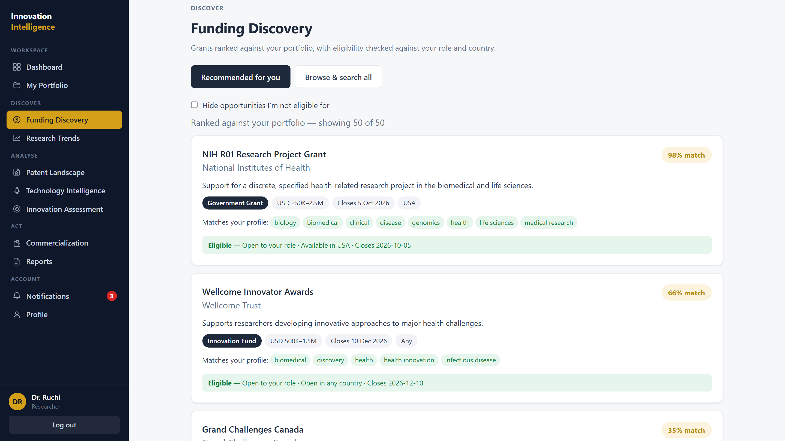
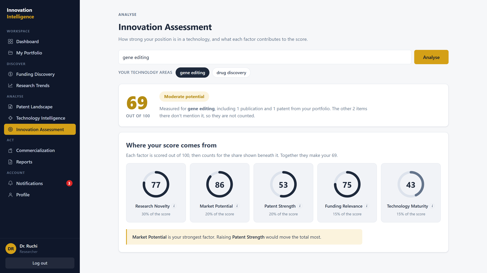
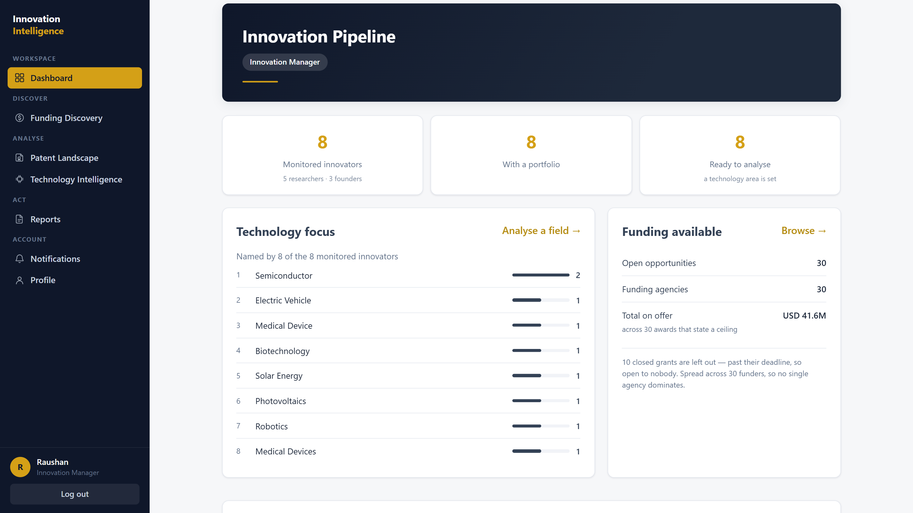

# Research Funding & Innovation Intelligence Platform

**Find the funding your work actually qualifies for, and know where it stands.**

A researcher with a good idea has to answer three questions before applying for
anything. Is there money open for this? Has somebody already patented it? Is the
field growing or already crowded? Those answers live in three different places —
grant portals, patent offices, publication databases — none of which know
anything about each other, and none of which know anything about you.

So the work gets done by hand. Searching portals one at a time, reading
eligibility rules that mostly rule you out, and guessing at the rest.

This platform reads your research profile once and answers all three from it.

[](https://innovation-intelligence-platform.vercel.app)

## Try it

| Email | Password |
|---|---|
| `ruchi@test.com` | `Demo_user` |

A read-only account, so everything can be opened and nothing can be broken. It
belongs to a gene-editing researcher, so the funding matches, the patent figures
and the innovation score are all real output for a real field — not placeholder
rows.

> Free hosting sleeps when idle. The page opens straight away, but the first
> sign-in after a quiet spell takes up to a minute to wake the API.



## How it works

You describe your work once — research domains, keywords, technology areas,
publications, patents, country. Every module then reads from that one profile.

**Funding** is matched on two things at once. Tag overlap against the grant's own
domains and keywords, and TF-IDF text similarity between your description and the
call. Eligibility — role, country, deadline — is checked rather than assumed,
so a grant you cannot apply for is marked as such instead of ranked third.

**Research trends** come from live OpenAlex data: publication growth over twelve
years, the busiest sub-fields, which topics are rising fastest, and the most
cited work in your area.

**Patents** come from the EPO's Open Patent Services. Field size, filing history,
and who actually holds the IP — queried per applicant across the whole corpus
where the source allows it, and marked as sample-based where it does not, so a
ranking never quietly mixes the two. Filings are grouped into themes with TF-IDF
and K-means, each named by the classification code its patents share.

**An innovation score** puts those signals together into one number out of 100,
from five weighted factors:

```
research novelty 30%  ·  patent strength 20%  ·  market potential 20%
technology maturity 15%  ·  funding relevance 15%
```

**A route to market** follows from the score — spin-out, partnership, licensing,
or validate first — split into what to do next and what is worth knowing, with a
prior-art warning where publishing before filing would put a patent at risk.



## Who uses it

| | |
|---|---|
| **Researcher** | Owns a portfolio. Gets matched funding, field trends, the patent landscape, a score and a route to market |
| **Startup founder** | Same portfolio and the same score, different advice — a founder is told to talk to a patent attorney before the next public demo, a researcher to talk to their technology transfer office |
| **Innovation manager** | Owns no portfolio. Gets a pipeline of every monitored innovator, what each works on, and the best funding open to them |
| **Administrator** | Platform health, the funding catalogue, account and role management, and the password-reset queue |



## The parts that matter

**Every number says what it was measured on.** Patent counts use the entire
corpus, because the EPO returns a total in one cheap request. Anything needing the
text *inside* a patent uses a date-balanced sample of up to 1,100 records — 100 per
year across eleven years, so no single year dominates. Cards state which they used.
Nothing derived from a sample is presented as a whole-field fact.

**The score cannot saturate.** Corpus sizes are normalised on a log scale and
growth through tanh. Without that, any field past a certain size scores identical
full marks and the factor stops carrying information.

**Recovery works without email.** The platform sends none, so a forgotten password
is recovered by an administrator's judgement instead of a link. Two security
questions give them something to weigh, and the browser holds a server-minted
claim so the new password is set in the page that never closed. The answers are
evidence, not a key — getting both right approves nothing by itself, because two
questions are a few hundred plausible guesses and would otherwise be a weaker door
than the password they protect.

**Being unknown looks the same as being known.** When the address is not registered,
sign-in still hashes a dummy password, so the expensive step runs either way and
response time cannot reveal who has an account. The recovery flow answers an
invented address exactly as it answers a real one, including the status poll.

**The tests walk the app rather than a list.** A route census enumerates every
endpoint the application actually serves and fails if one answers an
unauthenticated caller, or if an admin route answers an ordinary account. A
hand-written checklist reports full coverage while quietly going out of date; a
derived one cannot.

**Slow sources are seeded, not fetched.** Clustering, applicant tallies and
ownership are computed ahead of time and stored against a content hash, so no page
load waits on a rate-limited API. 23 technology topics ship pre-seeded and the app
runs from that cache with no API keys at all.

## Built with

| | |
|---|---|
| **FastAPI** — Python | Requests are validated by Pydantic before the code sees them, the OpenAPI docs generate themselves, and async matters when one page calls several external sources |
| **PostgreSQL** — SQLAlchemy 2 | Profiles, publications, patents and funding are linked records, and `JSONB` holds the domain and eligibility lists without a table each |
| **React** — Vite, React Router, Recharts | Charts draw as SVG so they stay sharp at any size, and protected routes keep the unauthenticated out of the shell — though the real check is always on the server |
| **scikit-learn** | TF-IDF and cosine similarity for matching, K-means for grouping patents into themes |
| **OpenAlex · EPO OPS · Grants.gov** | Real publication and patent data, plus 40 curated funding opportunities that ship with the repo, since no free API covers global grants properly |
| **openpyxl · ReportLab** | Nine reports render on screen, as a spreadsheet and as a PDF from one structure built on the server, so an export cannot state a figure the screen never showed |
| **Docker · GitHub Actions** | Every push builds both images, runs the frontend build, and runs 301 tests against a real PostgreSQL |
| **Vercel · Render · Neon** | Frontend, API and database. Requests are same-origin, so no cross-origin exposure is needed |

## Running it locally

**1.** Create a database and put its URL in `backend/.env` — see `.env.example`.

**2.** Start the API:

```bash
cd backend
python -m venv venv
venv\Scripts\activate          # Linux/macOS: source venv/bin/activate
pip install -r requirements.txt

python -m scripts.seed_funding
python -m scripts.create_admin you@example.org "Your Name" <password> --super
uvicorn app.main:app --reload
```

Runs on `http://localhost:8000`, with interactive docs at `/docs`. The schema is
brought up to date at startup, so there is no migration step to remember.

**3.** Start the frontend:

```bash
cd frontend
npm install
npm run dev
```

Runs on `http://localhost:5173` and proxies `/api` to the backend.

**Or the whole stack in containers:** `cp .env.example .env`, fill in
`POSTGRES_PASSWORD` and `SECRET_KEY`, then `docker compose up --build`. Compose
refuses to start without them.

### Tests

```bash
cd backend
pip install -r requirements-dev.txt
pytest
```

301 tests across 15 files, roughly five minutes, against a real PostgreSQL — the
schema uses `JSONB` and the code uses Postgres-only `INSERT ... ON CONFLICT`, so a
substitute database would mean testing code the deployment never runs. A separate
`<database>_test` database is created and dropped by the suite, so the development
database is never touched.

### Refreshing patent data

The patent modules read from the cache in `backend/app/data/`, so they work out of
the box. To rebuild or add a technology, put EPO OPS credentials in `backend/.env`
and run:

```bash
python -m scripts.seed_patent_series --all
python -m scripts.seed_patent_series "solid-state battery"
```

OPS allows a few searches per minute, so a topic takes a few minutes. The script is
resumable — finished topics are skipped.
